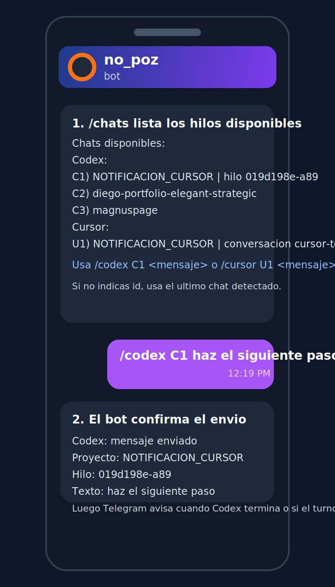
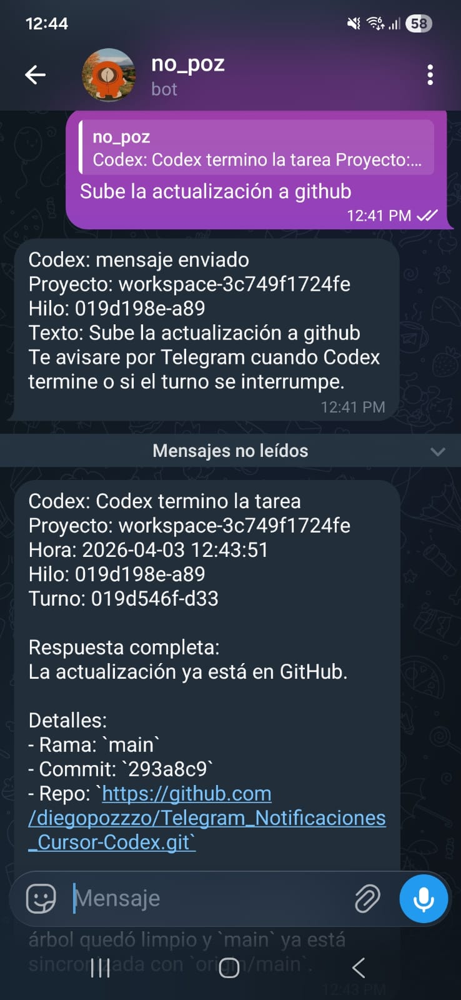
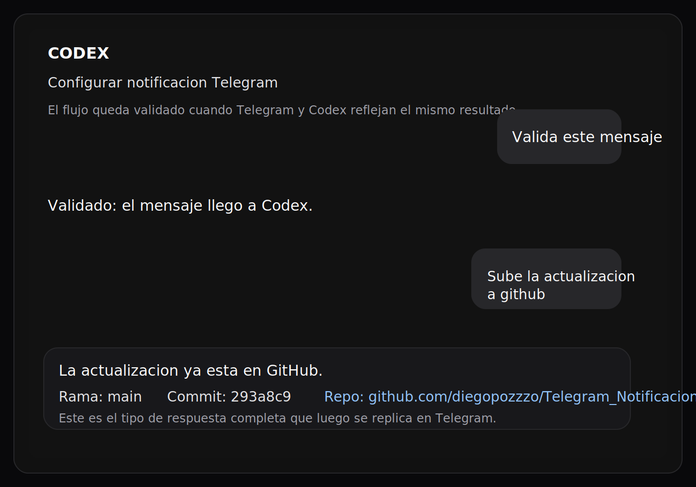

# Telegram Para Codex y Cursor

Puente local para operar proyectos con Codex desde Telegram y recibir notificaciones de Cursor sin estar mirando la laptop todo el tiempo.

El flujo principal esta pensado para Codex:

- manda Telegram cuando Codex termina una tarea
- manda Telegram cuando Codex queda esperando tu respuesta
- permite responder al mismo hilo desde Telegram
- divide respuestas largas en varios mensajes
- lista chats disponibles con `/chats`
- enruta mensajes con `/codex C1 ...` o `/cursor U1 ...`

Tambien incluye soporte para Cursor:

- notifica cuando Cursor se detiene usando el hook `stop`
- deja mensajes entrantes en un inbox local por proyecto con `/cursor`

Importante: el CLI de Cursor no expone una forma oficial de inyectar mensajes directamente al chat, asi que `/cursor` escribe el mensaje en un archivo local y lo abre en Cursor. Para trabajo 100% remoto desde Telegram, el camino mas fuerte hoy es Codex.

## Requisitos

- Windows con PowerShell 5.1 o superior
- `codex` CLI instalado y autenticado
- un bot de Telegram y tu `chatId`
- Cursor instalado si tambien quieres notificaciones o inbox para Cursor

## Paso a paso

### 1. Clona el proyecto

```powershell
git clone https://github.com/diegopozzzo/Telegram_Notificaciones_Cursor-Codex.git
cd .\Telegram_Notificaciones_Cursor-Codex
```

### 2. Crea tu bot y consigue el chat id

1. En Telegram abre `@BotFather`.
2. Ejecuta `/newbot` y crea el bot.
3. Guarda el token que te devuelve.
4. Abre un chat con tu bot y mandale cualquier mensaje.
5. Abre en el navegador:

```text
https://api.telegram.org/botTOKEN/getUpdates
```

6. Copia el valor `chat.id`.

### 3. Crea tu configuracion local

```powershell
Copy-Item .\config\telegram.settings.example.json .\config\telegram.settings.json
```

Edita `config/telegram.settings.json` y rellena:

- `botToken`
- `chatId`

Opcionales utiles:

- `enableTelegramReplies`: habilita respuestas entrantes desde Telegram
- `telegramPollTimeoutSeconds`: polling del bot
- `messagePrefix`: prefijo visible en los mensajes

Tambien puedes usar variables de entorno en vez del JSON:

- `CODEX_TELEGRAM_BOT_TOKEN`
- `CODEX_TELEGRAM_CHAT_ID`
- `CURSOR_TELEGRAM_BOT_TOKEN`
- `CURSOR_TELEGRAM_CHAT_ID`

### 4. Activa el proyecto

Solo Codex:

```powershell
powershell -NoProfile -ExecutionPolicy Bypass -File .\scripts\bootstrap-telegram.ps1
```

Codex + hook de Cursor:

```powershell
powershell -NoProfile -ExecutionPolicy Bypass -File .\scripts\bootstrap-telegram.ps1 -EnableCursorHook
```

Este paso:

- instala el watcher de Codex como aplicacion de arranque en Windows
- inicia una instancia en segundo plano ahora mismo
- opcionalmente instala el hook `stop` de Cursor

### 5. Prueba que responde

Prueba de tarea terminada:

```powershell
powershell -NoProfile -ExecutionPolicy Bypass -File .\scripts\watch-codex-sessions.ps1 -TestFinished
```

Prueba de espera de respuesta:

```powershell
powershell -NoProfile -ExecutionPolicy Bypass -File .\scripts\watch-codex-sessions.ps1 -TestWaiting
```

Si quieres validar sin pegarle a Telegram:

```powershell
powershell -NoProfile -ExecutionPolicy Bypass -File .\scripts\watch-codex-sessions.ps1 -TestFinished -DryRun
```

## Como se usa desde Telegram

### Comandos

- `/status`: muestra estado del watcher y el ultimo hilo detectado
- `/chats`: lista los chats conocidos y sus alias
- `/codex <mensaje>`: manda el mensaje al hilo mas reciente de Codex
- `/codex C1 <mensaje>`: manda el mensaje al chat `C1`
- `/cursor <mensaje>`: manda el mensaje a la conversacion mas reciente de Cursor
- `/cursor U1 <mensaje>`: manda el mensaje al chat `U1`

### Flujo recomendado

1. Abre un proyecto una vez con Codex localmente.
2. Espera la primera notificacion en Telegram.
3. Responde directamente a esa notificacion o usa `/chats`.
4. Sigue trabajando desde Telegram sobre ese mismo hilo.

Responder directo a una notificacion es la forma mas precisa porque el watcher ya sabe exactamente a que hilo volver.

## Referencias visuales

### Flujo de comandos en Telegram

La secuencia normal es:

1. ejecutar `/chats`
2. elegir un alias como `C1`
3. mandar `/codex C1 <mensaje>`
4. esperar el acuse y la respuesta final



### Respuesta final en Telegram

Cuando Codex termina, Telegram devuelve la respuesta completa en el mismo chat. Esta captura es una prueba real del flujo:



### Resultado reflejado en Codex local

La misma accion tambien queda visible en Codex local. Esta lamina resume el tipo de salida que luego se replica en Telegram:



## Como explorar proyectos desde Telegram

Para Codex:

- puedes continuar un hilo existente
- puedes responder a dudas del agente
- puedes pedir cambios nuevos en el mismo proyecto
- recibes la respuesta completa por Telegram

Para Cursor:

- recibes notificaciones cuando termina o se detiene
- puedes dejar mensajes en el inbox local del proyecto con `/cursor`
- el archivo se abre automaticamente en Cursor

Limitacion actual:

- el puente a Codex esta optimizado para continuar hilos existentes
- el puente a Cursor no escribe dentro del chat nativo de Cursor porque el CLI no lo soporta

## Archivos importantes

- `scripts/bootstrap-telegram.ps1`: activacion rapida del proyecto
- `scripts/watch-codex-sessions.ps1`: watcher principal de Codex
- `scripts/send-codex-thread-message.ps1`: reenvio de mensajes a un hilo de Codex
- `scripts/send-cursor-message.ps1`: inbox local para mensajes dirigidos a Cursor
- `scripts/install-codex-watcher.ps1`: instala el watcher al inicio de Windows
- `scripts/start-codex-watcher.ps1`: inicia el watcher manualmente
- `scripts/install-cursor-hook.ps1`: instala el hook `stop` de Cursor
- `scripts/notify-cursor-stop.ps1`: notificador del hook de Cursor
- `config/telegram.settings.example.json`: configuracion de ejemplo

## Logs y troubleshooting

Revisa estos archivos cuando algo falle:

- `logs/codex-telegram-watcher.log`
- `logs/codex-telegram-bridge.log`
- `logs/cursor-telegram-hook.log`
- `logs/cursor-telegram-bridge.log`

Notas utiles:

- `Codex termino la tarea` viene de `task_complete` y es confiable.
- `Codex espera tu respuesta` se infiere del mensaje final.
- si mandas dos mensajes seguidos al mismo hilo antes de que vuelva la respuesta, el bot bloquea el segundo para evitar cruces.
- el proyecto no versiona tu archivo real `config/telegram.settings.json`; usa el ejemplo y guarda tus credenciales localmente.
